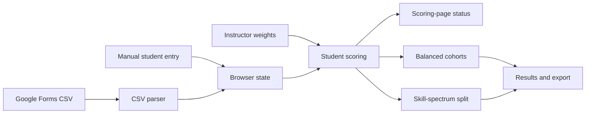

# Architecture

## Application shape

Sorting Hat is a browser-only static app. [index.html](../index.html) supplies the interface, [styles.css](../styles.css) supplies the presentation, and [app.js](../app.js) owns application state, scoring, sorting, CSV parsing, rendering, and CSV export. The browser stores the roster and instructor settings under the local-storage key `desinv-sortinghat-v4`.

## Scoring and sorting

### Evidence sources

Tool-familiarity responses contribute zero to three points. Selected professional or academic areas contribute fixed background evidence. Both are instructor-controlled signals: their influence can be set from 0× to 3× and their axis from −3 (hardware) to +3 (software).

Recent-activity responses and the optional manual self-described-practice answer are fixed signals. They remain in the position calculation when every instructor-controlled weight is off. They do not receive an instructor influence control.

A weighted signal with a non-zero axis affects a student’s hardware-to-software position. Any active instructor-controlled weight, including a neutral-axis weight, contributes to response confidence. Recent activity and manual self-described practice do not add response confidence.

### Scoring-page status

The Scoring page counts active instructor-controlled signals and explains which evidence currently drives the sort.

When all instructor weights are off, it distinguishes three cases:

1. Fixed activity or manual-practice evidence produces different sorting evidence across the roster. In balanced mode, it can distinguish students through spectrum position or raw hardware/software evidence totals; the spectrum split distinguishes students only by position.
2. Fixed evidence exists but produces the same sorting evidence for everyone. It does not distinguish the roster.
3. No fixed positional evidence exists. Every student is at Bridge (position 50).

### Cohort strategies and tie-breaks

The balanced strategy first considers students furthest from Bridge, with higher response confidence and then name used to resolve equal ordering. It assigns students while minimizing a loss based on avoidable cohort-size difference, orientation, hardware evidence, software evidence, confidence, and professional experience. It then accepts improving cross-cohort swaps, for at most 20 passes.

The skill-spectrum split ranks students from lower to higher position. Equal positions are ordered by higher response confidence, then alphabetical name; the lower half, rounded up for an odd-sized class, is the first cohort. This makes the split approximately 50/50.

With all instructor weights off, confidence is zero. If fixed evidence does not distinguish students by position, the skill-spectrum split is alphabetical. In the balanced strategy, a complete tie in position and hardware/software evidence falls back to professional experience and cohort size; names resolve exact ordering ties.
