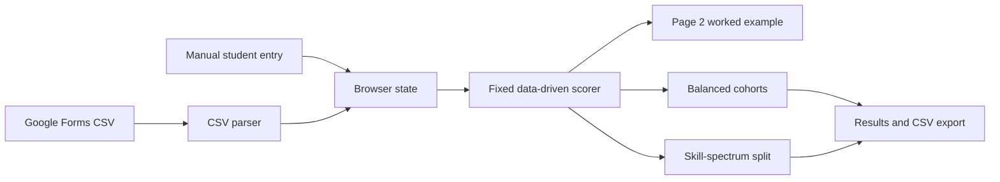

# Architecture

## Application shape

Sorting Hat is a browser-only static application. [index.html](../index.html) contains the interface, [styles.css](../styles.css) contains presentation, and [app.js](../app.js) owns browser state, CSV parsing, scoring, sorting, rendering, and CSV export. It has no server or build system.



## Scoring and sorting

### Fixed axes and evidence

There are no instructor weighting, axis-adjustment, reset-to-default-weights, or override functions. Each questionnaire definition supplies one fixed axis: negative values lean Hardware, positive values lean Software, and `0` is Bridge. Tool and selected-area evidence always uses that axis at equal `1×`.

A tool response is parsed on a 0–4 familiarity scale. Blank is `0`, unfamiliar is `1`, somewhat is `2`, moderately is `3`, and very familiar is `4`. Its evidence is `max(response − 1, 0)`, so blank and unfamiliar contribute `0`, while the remaining answers contribute `1`, `2`, or `3`. Every selected professional or academic area contributes fixed evidence of `2`.

The built-in questionnaire axes are declared in [app.js](../app.js):

| Tool | Axis |
| --- | ---: |
| Prototyping | -1.4 |
| CAD (Rhino, etc.) | -2.2 |
| Parametric modelling | -0.8 |
| Databases (MySQL, etc.) | 2.5 |
| Machine learning | 2.5 |
| Microcontrollers (Arduino, etc.) | -3 |
| Electronics (sensors + actuators) | -3 |
| Webhooks | 2.7 |
| APIs | 2.7 |
| JavaScript (p5.js, etc.) | 3 |
| 3D printing | -2.6 |
| Laser cutting | -2.8 |
| Figma | 0.8 |
| GitHub | 2.5 |
| GitHub Copilot | 2.3 |
| Visual Studio Code | 2.5 |
| Visual Studio | 2.3 |
| OpenAI (ChatGPT) | 1.8 |
| Large language models | 2.2 |
| Musical instruments | 0 |
| Project management tools | 0 |
| Natural language processing | 2.5 |

| Professional or academic area | Axis |
| --- | ---: |
| Technology and software development | 3 |
| Manufacturing and engineering | -3 |
| Design (graphic, UX/UI, industrial) | 0 |
| Marketing and sales | 0 |
| Healthcare and medical services | 0 |
| Finance and accounting | 1 |
| Education and training | 0 |
| Non-profit and social impact | 0 |
| Media and entertainment | 0.5 |

Recent-activity answers are separate fixed signals. Their parsed frequency level is 0–3 and their contribution uses a fixed `0.65` multiplier:

| Recent activity | Axis |
| --- | ---: |
| Contributed to a public or private GitHub repo | 2.5 |
| Built a microcontroller prototype | -3 |
| Made a CAD sketch or drawing | -2.3 |
| Used a writing assistant or AI such as ChatGPT | 1.6 |
| Used generative image AI such as Midjourney | 1.5 |

An optional manual direct-position response is a value from 1 through 5. It is not a questionnaire weight or a confidence input; it uses the fixed calculation described below.

### Position calculation

For each included tool or selected-area contribution:

```text
signed contribution       = evidence × fixed axis
directional contribution  = evidence × |fixed axis|
signed numerator          = Σ signed contribution
directional denominator   = Σ directional contribution
normalized direction      = signed numerator ÷ directional denominator
position                  = clamp(50 + normalized direction × 50, 0, 100)
```

Recent activity uses the same position arithmetic with its `0.65` multiplier:

```text
signed contribution      = activity level × fixed axis × 0.65
directional contribution = activity level × |fixed axis| × 0.65
```

The manual direct-position contribution is:

```text
signed contribution      = (direct position − 3) × 6
directional contribution = 12
```

Thus a manual choice of `3` has no signed direction but still adds `12` to the denominator. If the total directional denominator is `0`, normalized direction is `0` and position is `50`. Scores below `42` are Hardware, scores above `58` are Software, and the interval between them is Bridge.

### Response confidence

Confidence measures questionnaire response evidence, not the activity or manual signals. Its numerator is all tool evidence plus `2` for each selected area. Its denominator includes `3` possible points for every defined tool and `2` possible points for every selected area:

```text
confidence = clamp(questionnaire evidence ÷ possible questionnaire evidence × 100, 0, 100)
```

Because all questionnaire signals are fixed at equal `1×`, no weight modifies either confidence total. A zero-axis tool or area can increase confidence without changing directional position. With the current tool definitions, every student has possible tool evidence, so the normal rendered confidence calculation has a denominator even when every tool response is blank or unfamiliar.

### Page 2 worked example

The Scoring page presents a status description of the fixed model and selected cohort strategy. The instructor can select a loaded student for a live worked example. It lists each included tool, selected area, recent activity, and manual contribution with its signed calculation, signed-numerator amount, and directional-denominator amount. It then displays the total arithmetic, 0–100 placement, band, and confidence calculation. With no roster, the page asks for an import or a manual student; with no included evidence, it explains why no rows appear.

### Cohort strategies and tie-breaks

**Balanced cohorts** sorts students furthest from Bridge first; ties use higher response confidence and then name. It assigns each student to minimize a loss based on avoidable cohort-size difference, average position, normalized hardware evidence, normalized software evidence, confidence, and professional experience. It then accepts improving cross-cohort swaps for up to 20 passes. The displayed balance score describes similarity of those totals; it is not a student-quality score.

**Skill-spectrum split** ranks the room from lower to higher data-derived position. Equal positions are ordered by higher response confidence and then name. The lower half, rounded up for an odd-sized class, becomes Hufflestuff; the upper half becomes Ravenworks, producing an approximately 50/50 division. Both cohort names are separate from Hardware, Bridge, and Software signals, and both cohorts complete both course modules.

### Persistent browser state and migration

The browser stores state under the local-storage key `desinv-sortinghat-v4`. Stored state contains the roster, dataset label, selected cohort strategy, generated teams, and decision log. If a saved state has the legacy `weights` property, startup deletes that property and invalidates the prior generated teams and decision log because they were produced under the old weighted model. The roster and `sortMode` remain. Normal rendering saves the normalized state back to local storage. If browser local storage is unavailable, the app continues for the current session without persistence.
