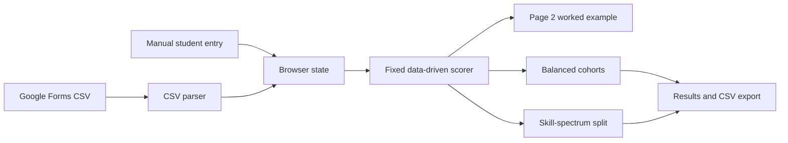

# Architecture

## Application shape

Sorting Hat is a browser-only static application. [index.html](../index.html) contains the interface, [styles.css](../styles.css) contains presentation, and [app.js](../app.js) owns browser state, CSV parsing, scoring, sorting, rendering, and CSV export. It has no server or build system.



## Scoring and sorting

### Categorical directions and equal evidence

There are no instructor weighting, axis-adjustment, reset-to-default-weights, or override functions. Each tool, professional/academic area, and recent-activity mapping has only a categorical direction:

| Direction | Value | Meaning |
| --- | ---: | --- |
| Hardware | `−1` | Moves a placement toward the Hardware end of the line. |
| Bridge | `0` | Does not move placement, but questionnaire evidence can still increase confidence. |
| Software | `+1` | Moves a placement toward the Software end of the line. |

The mappings are declared in [app.js](../app.js). Their values convey direction only, never relative strength: every raw evidence point produces one unit of signed and directional placement strength (unless it is Bridge, which produces zero directional strength).

A tool response is parsed on a 0–4 familiarity scale. Blank is `0`, unfamiliar is `1`, somewhat is `2`, moderately is `3`, and very familiar is `4`. Tool evidence is `max(response − 1, 0)`: blank and unfamiliar supply `0`, while the remaining answers supply `1`, `2`, or `3` equal-strength points. Each selected professional or academic area supplies one equal-strength point. Recent activity uses its parsed frequency level, `0`–`3`, directly; it has no multiplier. An optional manual direct-position response is a value from 1 through 5 and uses its signed distance from choice 3. It is not a confidence input.

### Position calculation

For each tool, selected-area, or recent-activity contribution:

```text
signed contribution       = raw evidence × categorical direction
directional contribution  = raw evidence × |categorical direction|
signed numerator          = Σ signed contribution
directional denominator   = Σ directional contribution
normalized direction      = signed numerator ÷ directional denominator
position                  = clamp(50 + normalized direction × 50, 0, 100)
```

The manual direct-position contribution is:

```text
signed contribution      = direct position − 3
directional contribution = |direct position − 3|
```

Thus a manual choice of `3` adds no signed or directional contribution. If the total directional denominator is `0`, normalized direction is `0` and position is `50`. Scores below `42` are Hardware, scores above `58` are Software, and the interval between them is Bridge.

### Response confidence

Confidence measures questionnaire response evidence, not activity or manual signals. Its numerator is all tool evidence plus one point for each selected area. Its denominator includes three possible points for every defined tool and one possible point for every selected area:

```text
confidence = clamp(questionnaire evidence ÷ possible questionnaire evidence × 100, 0, 100)
```

No weight modifies either confidence total. A Bridge tool or area can increase confidence without changing directional position. With the current tool definitions, every student has possible tool evidence, so the rendered confidence calculation has a denominator even when every tool response is blank or unfamiliar.

### Page 2 worked example

The Scoring page describes a response-driven equal-evidence model and the selected cohort strategy. It labels the three directions as Hardware `−1`, Bridge `0`, and Software `+1`, and states that tools, selected areas, recent activities, and manual distance are never multiplied by a tool-specific importance value. The instructor can select a loaded student for a live worked example. It lists each included contribution with its signed calculation, signed-numerator amount, and directional-denominator amount, then displays total arithmetic, 0–100 placement, band, and confidence calculation. With no roster, the page asks for an import or a manual student; with no included evidence, it explains why no rows appear.

### Cohort strategies and tie-breaks

**Balanced cohorts** sorts students furthest from Bridge first; ties use higher response confidence and then name. It assigns each student to minimize a loss based on avoidable cohort-size difference, average position, normalized hardware evidence, normalized software evidence, confidence, and professional experience. The implementation applies fixed trade-off coefficients to those cohort-level gaps, then accepts improving cross-cohort swaps for up to 20 passes. Those coefficients are an optimizer design choice, not evidence weights and do not change an individual student's placement calculation. The displayed balance score describes similarity of those totals; it is not a student-quality score.

**Skill-spectrum split** ranks the room from lower to higher data-derived position. Equal positions are ordered by higher response confidence and then name. The lower half, rounded up for an odd-sized class, becomes Hufflestuff; the upper half becomes Ravenworks, producing an approximately 50/50 division. Both cohort names are separate from Hardware, Bridge, and Software signals, and both cohorts complete both course modules.

### Persistent browser state and migration

The browser stores state under the local-storage key `desinv-sortinghat-v4`. Stored state contains the scoring-model version, roster, dataset label, selected cohort strategy, generated teams, and decision log. At startup, the app deletes a legacy `weights` property if present. It also invalidates generated teams and the decision log when either a legacy `weights` property was present **or** the saved scoring-model version differs from `SCORING_MODEL_VERSION`. In both cases, the roster and `sortMode` remain, and the state is recorded with the current scoring-model version. Normal rendering saves the normalized state back to local storage. If browser local storage is unavailable, the app continues for the current session without persistence.
