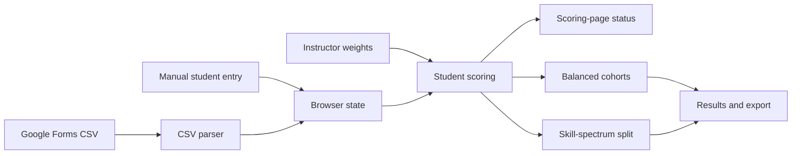

# Architecture

## Application shape

Sorting Hat is a browser-only static app. [index.html](../index.html) supplies the interface, [styles.css](../styles.css) supplies the presentation, and [app.js](../app.js) owns application state, scoring, sorting, CSV parsing, rendering, and CSV export. The browser stores the roster and instructor settings under the local-storage key `desinv-sortinghat-v4`.



## Scoring and sorting

### Evidence sources

Tool-familiarity responses contribute zero to three points. Selected professional or academic areas contribute fixed background evidence. Both are instructor-controlled signals: their influence can be set from 0× to 3× and their axis from −3 (hardware) to +3 (software).

Recent-activity responses and the optional manual self-described-practice answer are fixed signals. They remain in the position calculation when every instructor-controlled weight is off. They do not receive an instructor influence control.

A weighted signal with a non-zero axis affects a student’s hardware-to-software position. Any active instructor-controlled weight, including a neutral-axis weight, contributes to response confidence. Recent activity and manual self-described practice do not add response confidence.

### Position arithmetic

For an active tool signal, the response is converted to evidence as follows: a blank response (`0`) and an unfamiliar response (`1`) produce `0`; responses `2`, `3`, and `4` produce evidence `1`, `2`, and `3` respectively. A selected professional or academic area has fixed evidence `2`.

For each included instructor-controlled signal, the app adds the following to the position calculation:

```text
signed numerator       = evidence × axis × influence
directional denominator = evidence × |axis| × influence
normalized              = signed numerator total ÷ directional denominator total
position                = clamp(50 + normalized × 50, 0, 100)
```

An axis of `0` therefore adds `0` to both position totals: it cannot move a student away from Bridge. If the directional denominator is `0`, normalized is `0` and position is `50`. Positions below `42` are hardware, positions above `58` are software, and the interval in between is Bridge.

Recent activity uses its questionnaire frequency level (from `0` to `3`), its fixed signal axis, and a fixed `0.65` multiplier in the same signed and directional calculations. The manual self-described-practice response is a value from `1` to `5` and uses these fixed terms:

```text
signed numerator contribution = (direct position − 3) × 6
directional denominator contribution = 12
```

Consequently, the center manual response (`3`) contributes no signed direction but still supplies a denominator of `12`.

### Confidence arithmetic

Confidence reflects only active instructor-controlled signals. Its numerator is the student's tool evidence times each active tool's influence, plus `2 × influence` for each selected active area. Its denominator includes `3 × influence` for every active tool—even if the student left it blank or marked unfamiliar—and `2 × influence` for each selected active area.

```text
confidence = clamp(confidence evidence ÷ possible instructor evidence × 100, 0, 100)
```

Fixed activity and manual direct-position signals do not change confidence. The live worked example displays `N/A` rather than a percentage when all instructor-controlled signals are off, or when no active instructor-controlled signal applies to the selected student.

### Worked placement example

The Scoring page lets the instructor select a loaded student and renders a live placement explanation. It lists every non-zero included contribution, including its signed calculation, signed numerator amount, and directional-denominator amount. Beneath the table it displays the total position arithmetic, final location on the 0–100 line, and the confidence calculation. It updates when the selected student or an instructor weight changes. With no roster, it asks the instructor to import or add a student; with no included contributions, it explains whether the cause is all weights being off, no matching active signal, or blank/unfamiliar answers.

### Reset and default settings

`DEFAULT_WEIGHTS` is built from the curated axes and influence values declared for the tool and area definitions. It is used for a new browser state and when the instructor confirms **Start new session**.

The Scoring page's **Reset to neutral · 1× light** action is intentionally different: it gives every instructor-controlled signal axis `0` and influence `1`. This makes instructor-controlled evidence confidence-only until the instructor gives one or more signals a directional axis. The separate **Set instructor weights to off** action sets every instructor-controlled influence to `0`; fixed activity and manual signals, if present, still affect position.

### Scoring-page status

The Scoring page counts active instructor-controlled signals and explains which evidence currently drives the sort.

When all instructor weights are off, it distinguishes three cases:

1. Fixed activity or manual-practice evidence produces different sorting evidence across the roster. In balanced mode, it can distinguish students through spectrum position or raw hardware/software evidence totals; the spectrum split distinguishes students only by position.
2. Fixed evidence exists but produces the same sorting evidence for everyone. It does not distinguish the roster.
3. No fixed positional evidence exists. Every student is at Bridge (position 50).

### Cohort strategies and tie-breaks

The balanced strategy first considers students furthest from Bridge, with higher response confidence and then name used to resolve equal ordering. It assigns students while minimizing a loss based on avoidable cohort-size difference, orientation, hardware evidence, software evidence, confidence, and professional experience. It then accepts improving cross-cohort swaps, for at most 20 passes.

The skill-spectrum split ranks students from lower to higher position. Equal positions are ordered by higher response confidence, then alphabetical name; the lower half, rounded up for an odd-sized class, is the first cohort. This makes the split approximately 50/50.

With all instructor weights off, confidence is zero. If fixed evidence does not distinguish students by position, the skill-spectrum split is alphabetical. In the balanced strategy, a complete tie in position and hardware/software evidence falls back to professional experience and cohort size; names resolve exact ordering ties.
