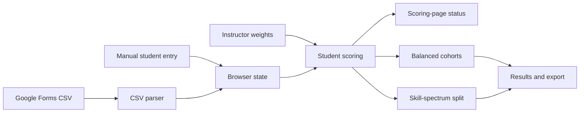

# Architecture

## Application shape

Sorting Hat is a browser-only static app. [index.html](../index.html) supplies the interface, [styles.css](../styles.css) supplies the presentation, and [app.js](../app.js) owns application state, scoring, sorting, CSV parsing, rendering, and CSV export. The browser stores the roster and instructor settings under the local-storage key `desinv-sortinghat-v4`.



## Scoring and sorting

### Evidence sources

Tool-familiarity responses contribute zero to three points. Selected professional or academic areas contribute fixed background evidence. Each tool and area definition has a built-in axis. Its effective setting is selected per row:

- **Baseline** — an influence of `0`, including a missing or invalid influence normalized to `0`, uses the definition’s built-in axis at `1×`. The stored instructor axis is not used while the row is baseline.
- **Instructor override** — an influence of `1`, `2`, or `3` uses the stored instructor axis and that influence instead. If that stored axis is missing or invalid, normalization substitutes the definition’s built-in axis while retaining the valid override influence.

Consequently, questionnaire evidence is always scored. The instructor control changes a row’s mapping; it does not turn off a student’s answer. A zero-axis override is an enabled, neutral override: it has `1×`–`3×` influence for confidence but no directional effect.

Recent-activity responses and the optional manual self-described-practice answer are fixed signals. They remain in the position calculation when every instructor-controlled weight is off. They do not receive an instructor influence control.

An effective questionnaire signal with a non-zero axis affects a student’s hardware-to-software position. Every effective questionnaire setting, including a baseline mapping or neutral override, contributes to response confidence. Recent activity and manual self-described practice do not add response confidence.

### Position arithmetic

For each tool response, a blank response (`0`) and an unfamiliar response (`1`) produce `0`; responses `2`, `3`, and `4` produce evidence `1`, `2`, and `3` respectively. A selected professional or academic area has fixed evidence `2`.

For each included questionnaire signal, using its effective axis and influence, the app adds the following to the position calculation:

```text
signed numerator       = evidence × axis × influence
directional denominator = evidence × |axis| × influence
normalized              = signed numerator total ÷ directional denominator total
position                = clamp(50 + normalized × 50, 0, 100)
```

An axis of `0` therefore adds `0` to both position totals: it cannot move a student away from Bridge. If the directional denominator is `0`, normalized is `0` and position is `50`. Positions below `42` are hardware, positions above `58` are software, and the interval in between is Bridge.

Recent activity uses its questionnaire frequency level (from `0` to `3`), its fixed signal axis, and a fixed `0.65` multiplier in the same signed and directional calculations. The manual self-described-practice response is a value from `1` to `5` and uses these fixed terms:

```text
signed numerator contribution = (direct position − 3) × 6
directional denominator contribution = 12
```

Consequently, the center manual response (`3`) contributes no signed direction but still supplies a denominator of `12`.

### Confidence arithmetic

Confidence reflects effective questionnaire evidence. Its numerator is the student's tool evidence times each tool's effective influence, plus `2 × effective influence` for each selected area. Its denominator includes `3 × effective influence` for every tool—even if the student left it blank or marked unfamiliar—and `2 × effective influence` for each selected area. A baseline row therefore uses `1×` in both calculations, while an enabled override uses its selected `1×`, `2×`, or `3×` influence.

```text
confidence = clamp(confidence evidence ÷ possible questionnaire evidence × 100, 0, 100)
```

Fixed activity and manual direct-position signals do not change confidence. The live worked example displays `N/A` only when no possible questionnaire evidence is available; normal baseline settings provide a possible-evidence denominator through the tool rows.

### Worked placement example

The Scoring page lets the instructor select a loaded student and renders a live placement explanation. It lists every included evidence contribution, including its signed calculation, signed numerator amount, and directional-denominator amount. Tool and area rows explicitly say either **baseline mapping at 1×** or **instructor override at N×**; a neutral override is also identified as confidence-only. Beneath the table it displays the total position arithmetic, final location on the 0–100 line, and the confidence calculation. It updates when the selected student or an instructor weight changes. With no roster, it asks the instructor to import or add a student; with no included contributions, it explains that blank and unfamiliar tools and unselected areas have no evidence points.

### Reset and default settings

`DEFAULT_WEIGHTS` is built from the curated axes and influence values declared for the tool and area definitions. It is used for a new browser state and when the instructor confirms **Start new session**.

The Scoring page's **Reset to neutral · 1× light** action is intentionally different: it gives every instructor-controlled signal axis `0` and influence `1`. This creates enabled, confidence-only overrides for every questionnaire row until the instructor gives one or more rows a directional axis.

**Use baseline · no instructor adjustments** sets every instructor influence to `0`. It preserves each stored axis for possible later re-enabling, but each baseline row displays and uses its definition’s built-in axis at `1×` while disabled. It does not discard tool or area responses. Fixed activity and manual signals continue to use their fixed position rules in both modes.

### Scoring-page status

The Scoring page counts enabled instructor overrides and baseline mappings, then describes the active model:

1. With all overrides baseline, it states that built-in questionnaire mappings at `1×` are active.
2. With enabled overrides that all have axis `0`, it states that those overrides are confidence-only and, if applicable, that other rows remain baseline mappings.
3. With a mix, it reports the directional override count and baseline-mapping count. Enabled rows override only their own questionnaire signals; all other rows retain their built-in mapping.

The status also describes the selected cohort strategy. Fixed activity and manual signals are unchanged in every status state.

### Cohort strategies and tie-breaks

The balanced strategy first considers students furthest from Bridge, with higher response confidence and then name used to resolve equal ordering. It assigns students while minimizing a loss based on avoidable cohort-size difference, orientation, hardware evidence, software evidence, confidence, and professional experience. It then accepts improving cross-cohort swaps, for at most 20 passes.

The skill-spectrum split ranks students from lower to higher position. Equal positions are ordered by higher response confidence, then alphabetical name; the lower half, rounded up for an odd-sized class, is the first cohort. This makes the split approximately 50/50.

Baseline mappings continue to produce confidence, so an all-baseline sort still uses response confidence in its normal ordering and balance calculations. If students tie on position, confidence, and the applicable balancing evidence, the existing name tie-break resolves their order.

### Persistent-state normalization

The app stores state under the browser local-storage key `desinv-sortinghat-v4`. On load, it ensures each defined tool and area has a setting. Numeric axes are clamped to `−3` through `3` and rounded to one decimal place. Valid influences are `0`, `1`, `2`, and `3`; a missing or invalid influence becomes baseline (`0`), and a missing or invalid axis falls back to the definition’s built-in axis. This lets older or partial saved settings adopt baseline semantics without removing questionnaire evidence.
