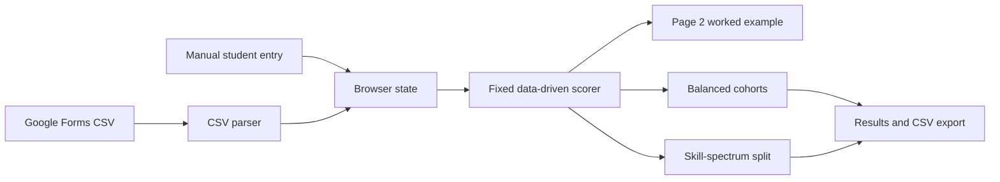

# Architecture

## Application shape

Sorting Hat is a browser-only static application. [index.html](../index.html) contains the interface, [styles.css](../styles.css) contains presentation, and [app.js](../app.js) owns browser state, CSV parsing, scoring, sorting, rendering, and CSV export. It has no server or build system.



## Scoring and sorting

### Categorical directions and the global question balance

There are no per-tool, per-area, per-activity, or per-student weighting controls. Each tool, professional/academic area, and recent-activity mapping has only a categorical direction:

| Direction | Value | Meaning |
| --- | ---: | --- |
| Hardware | `−1` | Moves a placement toward the Hardware end of the line. |
| Bridge | `0` | Does not move placement, but questionnaire evidence can still increase confidence. |
| Software | `+1` | Moves a placement toward the Software end of the line. |

The mappings are declared in [app.js](../app.js). Their values convey direction only, never relative strength within a category. A global Page 2 slider supplies the only directional adjustment: it applies one common multiplier to every mapped Hardware contribution and one common multiplier to every mapped Software contribution. Bridge has an effective multiplier of `1`, but its zero direction means it never contributes directional placement strength.

The form has unequal directional capacity. Maximum raw evidence is calculated from every mapped tool at three points, every mapped area at one point, and every mapped recent activity at three points:

| Direction | Tools | Areas | Activities | Maximum raw points |
| --- | ---: | ---: | ---: | ---: |
| Hardware | `7 × 3` | `1 × 1` | `2 × 3` | `28` |
| Software | `13 × 3` | `3 × 1` | `3 × 3` | `51` |

The **Hardware / Software question-balance** slider ranges from 0 to 100, in 0.1-point steps, and records the Software share; Hardware receives the remaining share. With `H = 28`, `S = 51`, `T = H + S = 79`, and slider shares `h` and `s` as decimals, the shared multipliers are:

```text
Hardware multiplier = h × T ÷ H
Software multiplier = s × T ÷ S
```

At the default center (`h = s = 0.5`), the multipliers are `79 ÷ 56 ≈ 1.4107` for Hardware and `79 ÷ 102 ≈ 0.7745` for Software. Thus `28 × 1.4107` and `51 × 0.7745` both equal `39.5`: a fully answered category has the same maximum directional opportunity on either side. Moving left intentionally favors Hardware; moving right intentionally favors Software. It does not differentiate questions on the same side.

The slider visually marks **Questions as-is** at Hardware `35.4` / Software `64.6` (the underlying Software share is `51 ÷ 79`). At that mark, both multipliers are exactly `1×`, so the original unequal number of mapped form opportunities is used without category balancing.

A tool response is parsed on a 0–4 familiarity scale. Blank is `0`, unfamiliar is `1`, somewhat is `2`, moderately is `3`, and very familiar is `4`. Tool evidence is `max(response − 1, 0)`: blank and unfamiliar supply `0`, while the remaining answers supply `1`, `2`, or `3` raw points. Each selected professional or academic area supplies one raw point. Recent activity uses its parsed frequency level, `0`–`3`, directly. The same category multiplier is then applied to every mapped tool, area, and activity on that direction. An optional manual direct-position response is a value from 1 through 5 and uses its signed distance from choice 3. It is not a confidence input or category-balanced.

### Position calculation

For each tool, selected-area, or recent-activity contribution, `category multiplier` is the global Hardware or Software multiplier above:

```text
signed contribution       = raw evidence × categorical direction × category multiplier
directional contribution  = raw evidence × |categorical direction| × category multiplier
signed numerator          = Σ signed contribution
directional denominator   = Σ directional contribution
normalized direction      = signed numerator ÷ directional denominator
position                  = clamp(50 + normalized direction × 50, 0, 100)
```

The manual direct-position contribution is:

```text
signed contribution      = direct position − 3
directional contribution = |direct position − 3|
```

Manual direct position is deliberately not adjusted by the question-balance slider. Thus a manual choice of `3` adds no signed or directional contribution. If the total directional denominator is `0`, normalized direction is `0` and position is `50`. Scores below `42` are Hardware, scores above `58` are Software, and the interval between them is Bridge.

### Response confidence

Confidence measures questionnaire response evidence, not activity or manual signals. Its numerator is all tool evidence plus one point for each selected area. Its denominator includes three possible points for every defined tool and one possible point for every selected area:

```text
confidence = clamp(questionnaire evidence ÷ possible questionnaire evidence × 100, 0, 100)
```

The question-balance slider does not modify either confidence total. A Bridge tool or area can increase confidence without changing directional position. With the current tool definitions, every student has possible tool evidence, so the rendered confidence calculation has a denominator even when every tool response is blank or unfamiliar.

### Page 2 worked example

The Scoring page places the global balance control above the formula and cohort-strategy controls. It shows the current Hardware / Software shares, the two resulting point multipliers, and the marked Questions-as-is position. The range input has an accessible label and value text; the marker is also exposed with its ratio and `1×` meaning.

Moving the slider immediately updates placements, the roster, preview, scoring status, worked example, and results display. It clears existing teams and the decision log because those were produced with a different directional balance, then persists the updated value. The status card and generated decision log disclose the active Hardware and Software multipliers.

The instructor can select a loaded student for a live worked example. It lists each included contribution with its category multiplier in the signed calculation, signed-numerator amount, and directional-denominator amount, then displays total arithmetic, 0–100 placement, band, and confidence calculation. Manual rows explicitly state that their distance from the center is not adjusted. With no roster, the page asks for an import or a manual student; with no included evidence, it explains why no rows appear.

### Cohort strategies and tie-breaks

**Balanced cohorts** sorts students furthest from Bridge first; ties use higher response confidence and then name. It assigns each student to minimize a loss based on avoidable cohort-size difference, average position, normalized hardware evidence, normalized software evidence, confidence, and professional experience. The implementation applies fixed trade-off coefficients to those cohort-level gaps, then accepts improving cross-cohort swaps for up to 20 passes. Those coefficients are an optimizer design choice, not evidence weights and do not change an individual student's placement calculation. The displayed balance score describes similarity of those totals; it is not a student-quality score.

**Skill-spectrum split** ranks the room from lower to higher data-derived position. Equal positions are ordered by higher response confidence and then name. The lower half, rounded up for an odd-sized class, becomes Hufflestuff; the upper half becomes Ravenworks, producing an approximately 50/50 division. Both cohort names are separate from Hardware, Bridge, and Software signals, and both cohorts complete both course modules.

### Persistent browser state and migration

The browser stores state under the local-storage key `desinv-sortinghat-v4`. Stored state contains the scoring-model version, `directionBalance`, roster, dataset label, selected cohort strategy, generated teams, and decision log. `directionBalance` is normalized to the slider’s 0–100 range and one-decimal precision; new sessions start at `50`.

The current `SCORING_MODEL_VERSION` is `3`. At startup, the app deletes a legacy `weights` property if present. It invalidates generated teams and the decision log when a legacy `weights` property was present, `directionBalance` needed normalization, or the saved scoring-model version differs from `3`. The roster and `sortMode` remain, and state is recorded with the current version. Normal rendering saves normalized state back to local storage. If browser local storage is unavailable, the app continues for the current session without persistence.
